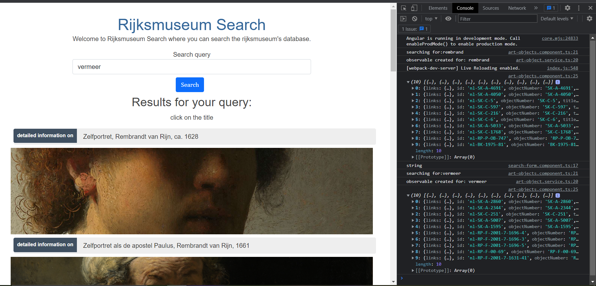

# Client-Side-Programming Assessment

## Part one:

<hr>
You will find my anagram assignment in:

[anagrams.html](anagrams.html)

The program logs the output array to the console.

## Part two:

<hr>

This part was quite a challenge for me, since my education at Code Institute did not include any javacript framework. Nor did i have any prior experience with Typescript...
I've done a tutorial on react after my studies, but that's about all my js framework knowledge up until now..

My approach to this assignment was therefore to learn myself the basics of angular, since that is what is most used at Endeavour Heroes. If i need to learn it, why wait right?

I started following the tutorials and while doing them, rewriting the code somewhat so that i could use it in this project.

I've built an art-object Service that returns an Observable which the art-object-detail component and art-object component subscribe to.
I've also added a very basic error handling to the service.
This using catchError, Observable, of and tap from the RxJS library.

I've added some validation with dynamic values to the search query field. However, i could not manage to get it to work properly in the dom.

Hard coding the query in the ngOnInit method in the art-objects component ( of course not what i want... ) does result in correct display of various search queries.
See here:

```
  ngOnInit(): void {
    this.onGetArtObjects('rembrand');
  }
```

<hr>

## Bugs:

The search box returns the values in console, but results are not rendered to the page.




<hr>

### Tool used to create interfaces for typescript:
https://transform.tools/json-to-typescript